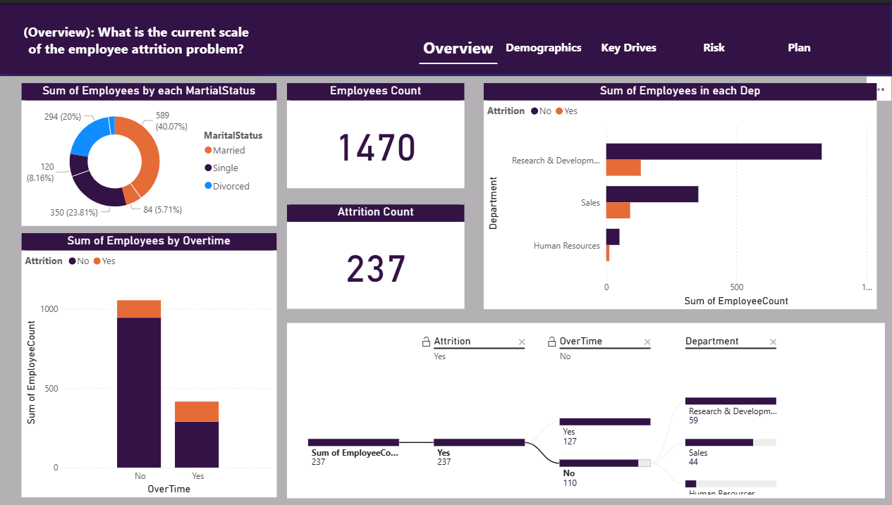
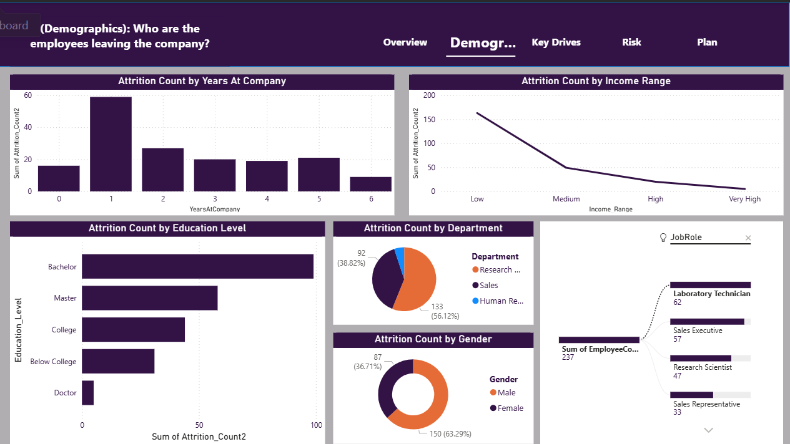
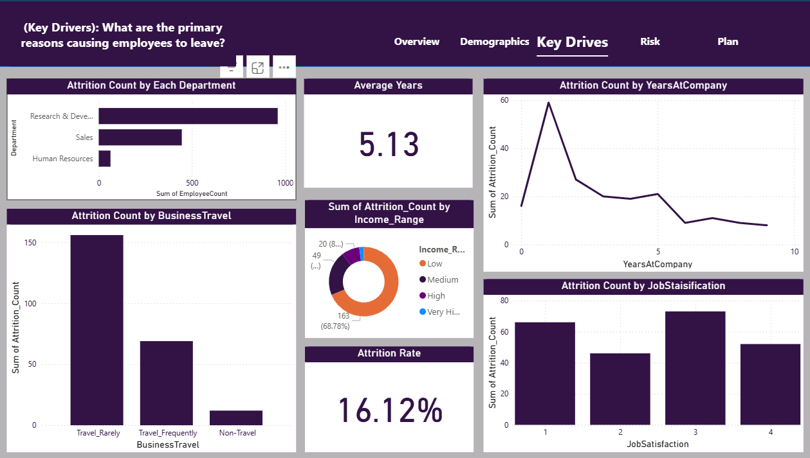
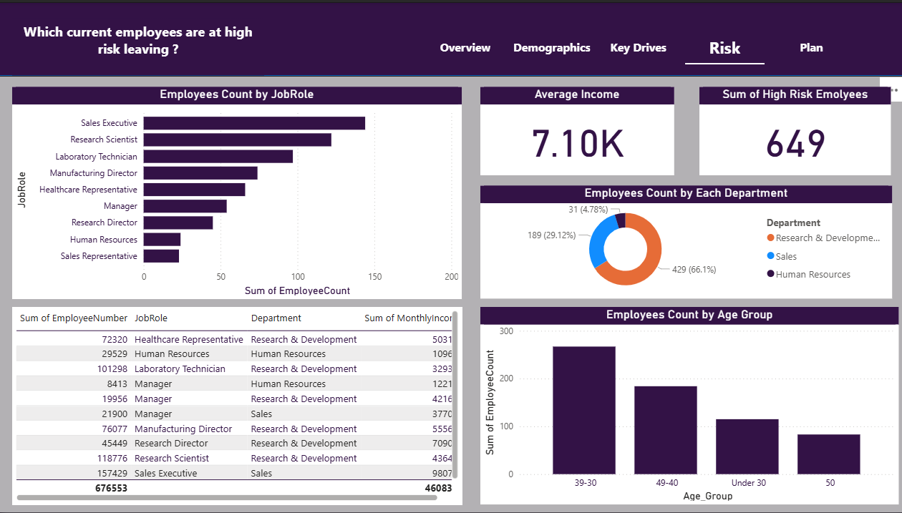
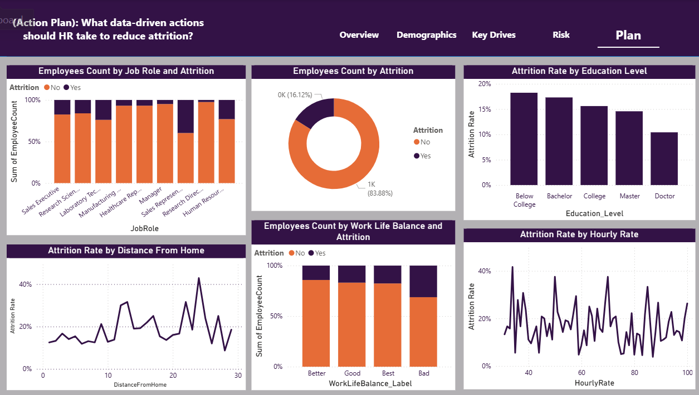

# HR-Analytics-Dashboard
# 📊 HR Analytics: Employee Retention Dashboard

## 📖 Project Overview
This project is a storytelling-driven dashboard built with **Microsoft Power BI** to analyze employee attrition.
The goal was not just to visualize data, but to answer **5 critical business questions** regarding why employees leave and how to retain them.

**Tools Used:** Power BI, Power Query, DAX, Excel.

---

## 🚀 Dashboard Journey (The 5 Questions)

### 1️⃣ Page 1: The Overview (What is the scale of the problem?)
This page establishes the context for the management. It highlights the overall attrition rate and identifies the most affected departments.

* **Key Insight:** The company has a **16.12% attrition rate**, with the **Sales Department** facing the heaviest losses.

---

### 2️⃣ Page 2: Demographics Analysis (Who is leaving?)
Here, we analyze the profile of the leavers. We look at age groups, gender, and marital status to find patterns.

* **Key Insight:** There is a significant **"Youth Exodus"**; employees **under 30** are leaving at a much higher rate (~28%) compared to older age groups.

---

### 3️⃣ Page 3: Key Drivers (Why are they leaving?)
This analysis digs into the root causes, correlating attrition with factors like Overtime, Income, and Work-Life Balance.

* **Key Insight:** **Burnout is real.** Employees with a "Bad" Work-Life Balance score have double the attrition rate of satisfied employees. Also, Sales Representatives show a critical 40% turnover.

---

### 4️⃣ Page 4: Risk Analysis (Who is at risk now?)
Moving from descriptive to predictive, this page uses DAX logic to identify **current active employees** who show the same risk factors (Overtime + Low Satisfaction) as those who left.

* **Action:** A specific list of high-risk employees is generated for immediate manager intervention.

---

### 5️⃣ Page 5: Action Plan (What should HR do?)
The final page translates insights into strategic recommendations.

* **Recommendations:**
    1.  Conduct "Stay Interviews" specifically for the Sales Team.
    2.  Implement a strict policy to limit Overtime and monitor burnout.
    3.  Create a mentorship program and career path for employees under 30.

---

## 🏁 Conclusion
The analysis shows that attrition is not random. It is driven by specific friction points in **Sales roles** and **Youth engagement**. By targeting these areas, HR can significantly reduce turnover costs.

**Author:** [Adham  mahmoud ]
**Dataset:** IBM HR Analytics Employee Attrition  
